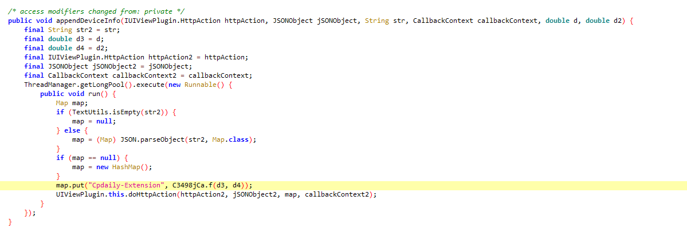
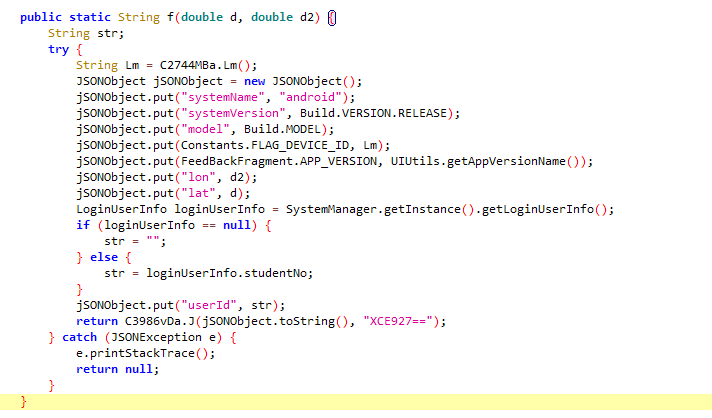

# auto-submit
# 今日校园每日自动提交疫情上报py脚本
### 感谢大佬ZimoLoveShuang,这是项目[源地址](https://github.com/ZimoLoveShuang/auto-submit)
### 此项目仅仅对大佬获取cookies不通用进行补充,但使用selenium会有点资源浪费,仅作个人使用,问题不大
# 使用
1. clone 或者 下载 此仓库到本地
    ```shell script
    git clone https://github.com/nonepage/auto-submit.git
    ```
2. 打开本地仓库文件夹，配置config.ini中对应的学号（xh）和密码（pwd），**注意这里的学号和密码都是智慧校园的学号和密码**
3. 使用pip等 Python 包管理工具安装依赖库
    ```shell script
    pip install requests
    ```
4. 利用python命令执行main.py脚本
    ```shell script
    python main.py
    ```

# 说明
1. 此项目只适用于川信学子，其他学校，可以查看源码修改提交链接即可
2. 此项目依赖python3.8运行环境，如没有，自行安装
3. 此项目依赖configparser requests json time等python库，如没有，自行安装
4. 此项目依赖selenium获取cookies,需要安装对应浏览器驱动版本,Google浏览器[点击这里](https://chromedriver.storage.googleapis.com/index.html),其他浏览器请自行百度
5. 此项目默认提交全部正常的情况，如果有其他情况，请自行在今日校园app上提交

# 设计思路
1. 模拟登陆
2. 获取表单
3. 填充表单
4. 提交表单

# 其他
1. 关于Cpdaily-Extension：今日校园APP的处理是登陆时获取，每台设备唯一，但是有个空子就是，只要你不退出登陆，这个就会一直被维持，一直有效，换句话说，就是在APP上手动退出后失效，所以无需重复抓包获取


2. 关于抓包：今日校园APP某些接口启动了ssl pinning机制，一般的方法无法抓包
3. 提供一个参考的破解ssl pinning机制的方法：使用逍遥安卓4.4.4模拟器，配合xposed框架，使用justtrustme模块，hook掉验证证书的函数即可抓包
4. 逆向apk亦可破解ssl pinning和sign算法，意外发现是今日校园v8.0.8及之前的版本没有加固
5. **本项目仅供学习交流使用，如作他用所承受的任何直接、间接法律责任一概与作者无关（下载使用或参考项目即代表你同意此观点）**
# 使用了此脚本或者参考了这个项目，请自觉给项目点个star
